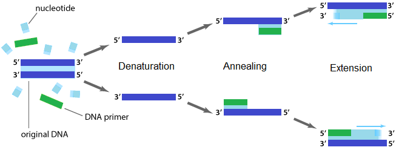
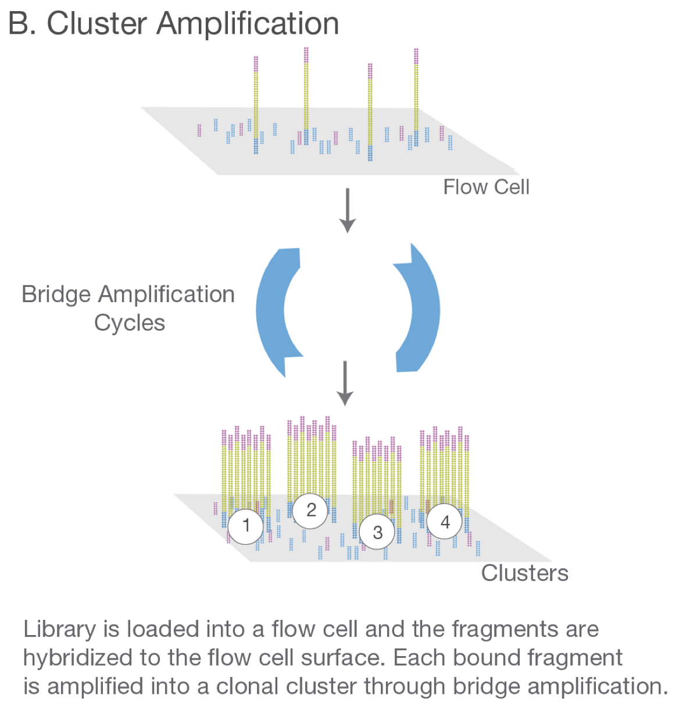
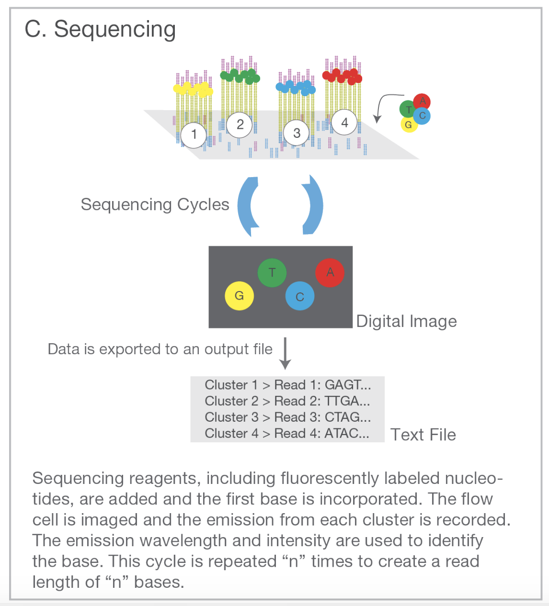

## Introduction

DNA sequencing is the process of determining the nucleotide sequence of a DNA segment. DNA sequencing plays a prominent role in modern genomic assays. In this post we cover "next-generation" sequencing (also known, perhaps more accurately, as "second generation" sequencing). Next-generation sequencing (in contrast to "first generation" sequencing) is a type of sequencing based on DNA amplification and synthesis. The vast majority of sequencing data today are generated by next-generation sequencing machines. We also discuss the closely related technology of polymerase chain reaction (PCR), a method for cloning DNA. We start with PCR, as PCR is a crucial step in next-generation sequencing.

## Polymerase chain reaction

* Polymerase chain reaction (PCR) is a method for making many copies of a DNA segment.

* PCR plays an important role in DNA sequencing and other genomic technologies.

* To perform PCR, we make a solution that contains (i) the DNA segment to be copied, (ii) a pair of DNA primers (one for the bottom strand and one for the top strand), (iii) nucleotide bases, and (iv) a DNA polymerase.
* We then pass through the following steps (by changing the temperature of the solution from step to step):
  + 1. Separate the two DNA strands (called **denaturation**).
  + 2. Allow the primers to bind to their complementary sequences (called **annealing**).
  + 3. Allow DNA polymerase to synthesize two complimentary strands (called **extension**).
  + 4. Repeat process.
  
 

{#id .class width=85% height=85%}

*A schematic of PCR.*

 

* These steps result in the exponential growth in the number of copies of the starting DNA segment.

* Some biology notes:
  + We need DNA primers because DNA polymerase only can add bases to an existing segment of DNA.
  + We need two separate DNA primers (one for the top strand and one for the bottom strand) because DNA polymerase synthesizes DNA in the 5' to 3' direction only.
  + To design the primers, we must know the sequence of the DNA segment that we seek to copy (or more precisely, the sequence at both ends of the segment).

## Next-generation sequencing

* Next-generation sequencing is a type of DNA sequencing that involves DNA amplification and synthesis.

* The most commonly-used protocol for next-generation sequencing the Illumina protocol, which is the one we will discuss here.

* Our objective, given a DNA segment and reference genome, is to determine from which part of the genome the DNA segment came.

* Next-generation sequencing takes place over four steps.

### Step 1: Library preparation

* A segment of DNA is isolated.
* The segment optionally is fragmented into smaller pieces. This fragmentation facilitates parallel sequencing.
* Short, artificial DNA segments called **adapters** are attached (or **ligated**) to each DNA fragment. Adapters help drive subsequent amplification and sequencing steps. Biologists carrying out the sequencing know the nucleotide sequence of the adapters.
* The DNA fragments are amplified through PCR.
  + Primers complimentary to the ligated adapters are used to prime the PCR. The researchers are able design such primers because they know the sequence of the adapters.
  + PCR is necessary because many copies of a given DNA segment are required to sequence that segment.

 
 

{#id .class width=50% height=50%}

*Figure 2: Library preparation. The pink and blue bars are short, artificial segments of DNA called adapters. Adapters contain primers for amplification and other subsequences for downstream sequencing. The DNA segment is fragmented, the adapters are ligated, and the fragments are amplified (or cloned) through PCR.*

 

### Step 2: Cluster amplification

* The library of DNA fragments is loaded onto a flat surface called a flow cell.
* **Oligonucleotides** (short, artificial DNA fragments) complimentary to the adapters are glued to the surface of the flow cell, like blades of grass on a patch of soil (represented by blue and pink bars in Figure 3).
* Each DNA fragment anneals to a single bound oligonucleotide through its adapter.
* Through a special type of PCR called **bridge amplification**, each bound fragment is copied many times to create a cluster of cloned fragments.
* The advantage of bridge amplification (over standard PCR) is that (i) the cloned fragments are spatially localized, and (ii) the cloned fragments remain connected to the flow cell after bridge amplification finishes.
* At the end of this step, we have distinct clusters of cloned fragments spread across the flow cell.

 
 

{#id .class width=50% height=50%}

*Figure 3: Cluster amplification. Cluster amplification (in this example) produces four clusters, labeled 1-4. Fragments in a given cluster are clones of one another. Note: the color of the adapters and bound oligonucleotides in Figure 3 does not relate to the color of the adapters in Figure 2.*

 

### Step 3: Sequencing

* Sequencing is carried out by synthesis of a complimentary DNA strand (a process called **sequencing by synthesis**).
* Special nucleotides called **dNTP**s are used. dNTPs are like normal nucleotides but differ in two important ways.
  + First, dNTPs have a special chemical group called a **terminator**. When a dNTP is incorporated into a growing DNA chain, the terminator prevents the incorporation of additional nucleotides.
  + Second, dNTPs have a florescent tag attached, with a different colored tag for each type of nucleotide.
* To carry out sequencing, we pass through the following steps.
  + 1. Add a solution of primers, DNA polymerases, and dNTP nucleotides to the flow cell.
  + 2. Allow the primers to anneal to the bound adapters (shown in the figure below as pink and blue bars).
  + 3. Allow polymerase to incorporate a dNTP into the growing chain of nucleotides. Synthesis temporarily halts because dNTP possesses a terminator.
  + 4. Use a laser to excite the fluorescent tag of the dNTP, causing the tag to emit light. Because each type of nucleotide possesses a differently colored tag, the color of the emitted light reveals the type of nucleotide that was just incorporated.
  + 5. Remove the flourecent tag and terminator of the newly added dNTP, turning the dNTP into a normal nucleotide.
  + 6. Repeat steps 3-5 until synthesis is complete.
* The series of colored flashes reveals the sequence of the fragment.
* Fragments in a given cluster emit the same series of colored flashes (as they share the same sequence), allowing a computer to decipher the sequence of the fragment.
* Each cluster generates a single read.

 
 

{#id .class width=65% height=65%}

*Figure 4: Sequencing. All fragments within a cluster emit the same series of colors (as they are identical), allowing a computer to determine the sequence of the fragment. Note: the color of the adapters and bound oligonucleotides in Figure 4 do not relate to the color of the adapters in Figure 2.*

 

### Step 4: Alignment
* The newly-identified sequence reads are mapped onto a reference genome using bioinformatic software. This is possible because each fragment is about 350 nucleotides in length, and there are $4^{350} \approx 10^{180}$ (a huge number!) of possible DNA sequences of length 350.
* The initial DNA segment was fragmented before amplification and synthesis. Therefore, we would expect a bunch of small fragments to map to adjacent locations of the genome. Using this information, we can deduce the region of the genome from which the original DNA segment came.
* For a great summary of second-generation sequencing, see this [video](https://www.youtube.com/watch?v=shoje_9IYWc). The volume of the music at the end of the video is loud, so headphone users beware!

## References

1. [An introduction to next-generation sequencing technology (Illumina, 2015)](https://www.illumina.com/content/dam/illumina-marketing/documents/products/illumina_sequencing_introduction.pdf).

2. [Genetics: A conceptual approach (Pierce 2014)](https://www.amazon.com/Genetics-Conceptual-Approach-Benjamin-Pierce/dp/1319050964/ref=sr_1_1?crid=25RZM1CCNNRAZ&dchild=1&keywords=genetics+a+conceptual+approach+6th+edition&qid=1590651043&sprefix=genetics%3A+a+conc%2Caps%2C189&sr=8-1).

3. [Image 1 source](https://www.xxpresspcr.com/all-news/polymerase-chain-reaction-the-past-present-and-future/)

4. [Images 2 - 5 source](https://www.illumina.com/content/dam/illumina-marketing/documents/products/illumina_sequencing_introduction.pdf)