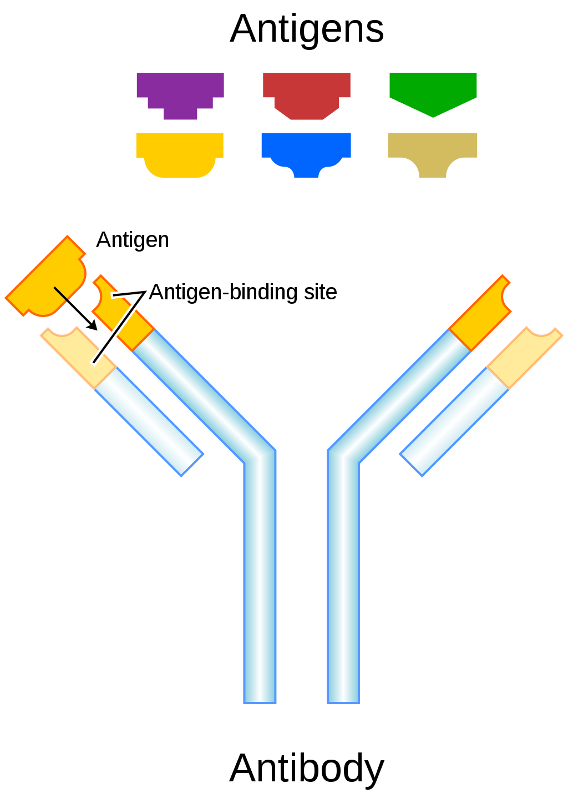

## Introduction and background
* ChIP-seq is a technology that reveals the epigenetics of tissue or a cell.
* ChIP-seq is used to uncover two types of epigenetic marks: transcriptional regulators and histone modifications.
  + 1. Transcriptional regulators are proteins that bind to sequence-specific regions of the DNA (e.g., enhancers, promoters, or silencers) and modulate the transcription of a nearby gene.
  + 2. Histone modifications are chemical changes to histone proteins (i.e., the proteins that bind DNA to form chromatin). Histone modifications are associated with specific biology. For example, acetylation (e.g., acetylation of lysine 9 of histone, denoted H3K9ac) is associated open chromatin and thus transcription.
* The purpose of ChIP-seq is to discover the location and type of these epigenetic modifications genome-wide through use of bulk RNA-seq.
* ChIP-seq makes heavy use of **antibodies.** Antibodies are large, Y-shaped proteins that bind to a specific protein, called an antigen. An antibody and antigen are analogous to a lock and key.

 

{#id .class width=50% height=50%}

*An antibody (bottom) and a set of antigens (top). The antibody binds to a specific antigen (and to that antigen only), in this case the yelllow antigen.*

 

* Antibodies are found naturally in the immune system. We will use antibodies here to identify and bind specific proteins of interest.

## ChIP-Seq protocol

* First, we decide which protein (or histone modification) we would like to target in the experiment.  

* Next, we design or identify an antibody that binds to this protein (and this protein only).

* 