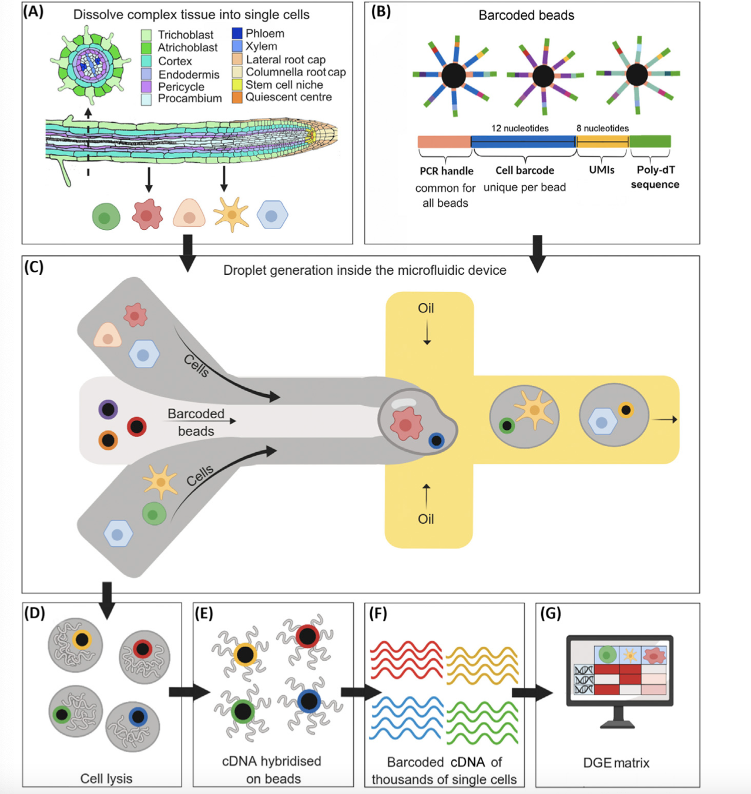
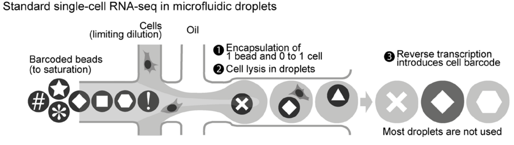
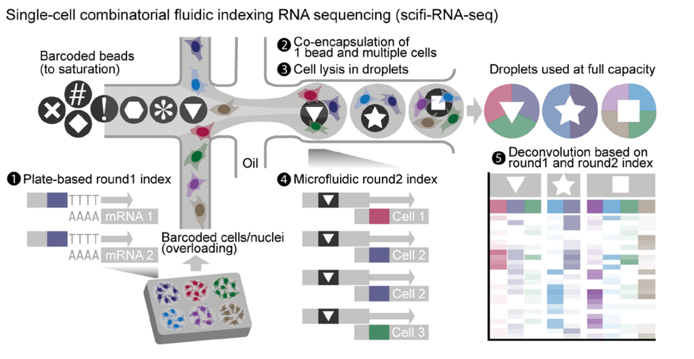
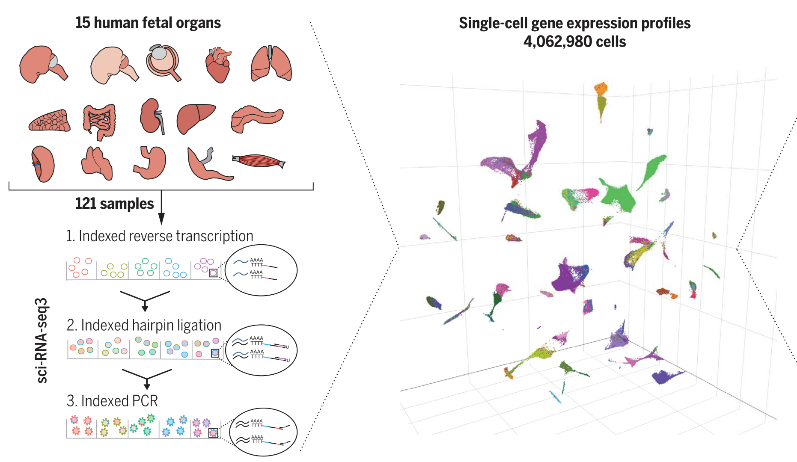

# 1. Single-cell sequencing

Single-cell sequencing is a technology that provides a snapshot of the transcriptome (i.e., the set of gene expressions) of a collection of individual cells. We present a brief ovewview of single-cell sequencing.

 

{#id .class width=100% height=100%}

- **a)** Start with some tissue or collection of cells. Often, the tissue consists of cells of many types, and the goal is to use single-cell sequencing to identify those cell types.
- **(b)** Generate lots of barcoded beads. Each barcoded bead consists of two parts: (i) a bead, and (ii) a short oligonucleotide (or "oligo"). The oligos are tethered to the bead, like hairs on a person's head.

The oligo is made of up several smaller parts.

1. PCR handle -- this is required for the PCR and sequencing steps; it is common across all oligos on all beads.
2. Cell barcode -- this identifes the cell; importantly, the cell barcode is the same across all oligos on a given bead.
3. UMI (unique molecular identifier) -- each oligo on a given bead has a distinct UMI. The UMI eliminates bias that arises during the PCR and sequencing steps.
4. Poly-dt sequece -- a long sequence of T nucleotides. This captures the mRNA transcripts, which are polyadenylated after transcription.

- **(c)** Using a microfluidic device, trap each cell inside a droplet along with a barcoded bead.

- **(d)** Lyse the cells within the droplets.

- **(e)** The mRNAs bind the oligos. Use reverse transcription to generate cDNAs hybridized to the bead surface.

- **(f)** Wash the cDNAs away from the beads, and sequence in bulk (see [this post](https://timothy-barry.github.io/posts/2020-06-03-second-generation-sequencing/) for a review of sequencing).

- **(g)** Use software (e.g., cellranger) to generate the cell-by-gene expression matrix. This roughly involves (i) collapsing all reads with the same UMI into a single read, (ii) determining the cell from which a read came, and (iii) mapping the read onto a reference genome to determine the gene from which the read came.

# 2. Large-scale single-cell sequencing

- There is a major limitation to standard (or small-scale) single-cell sequencing: each droplet can contain at most one cell. If multiple cells are captured in a single droplet, then their transcriptomes are impossible to distinguish.

- Experimenters do not have exact control over how many cells are captured in a droplet; this quantity is Poisson-distributed. By experimental design, *the majority of droplets contain zero cells*.

 

{#id .class width=100% height=100%}

- A new strategy called *scifi-RNA-seq* rectifies this inefficiency. 

 

{#id .class width=100% height=100%}

- 1. The cells are divided into groups on a microwell plate (i.e., a plate with a bunch of wells). The membrane of each cell is permeabilized (not lysed), and the entire transcriptome is barcoded with a round-1 barcode and reverse transcribed into cDNA. A UMI and PCR handle are also added during this step. In the figure, the round-1 barcodes are shown in color.

- 2. Using a microfluidic device, capture multiple cells inside a droplet along with a barcoded bead.

- 3. Lyse the cells inside the droplets.

- 4. Ligate a round-2 barcode onto the cDNAs. In the figure, the round-2 barcodes are represented as shapes.

- 5. Pool together the cDNAs and sequence them in bulk. Use software to generate the cell-by-gene expression matrix. Use both the round-1 *and* round-2 barcodes to determine the cell from which a transcript came.

# 3. Applications

- Large-scale single-cell sequencing enables exciting new applications in single-cell CRISPR screens, cell atlases, and population genomics.

- *sci-RNA-seq3* (a method related to *scifi-RNA-seq*) was used to generate an atlas of human fetal tissue.

 

{#id .class width=100% height=100%}

- Large-scale single-cell sequencing opens new opportunities for statisticians, data scientists, and computer scientists.
