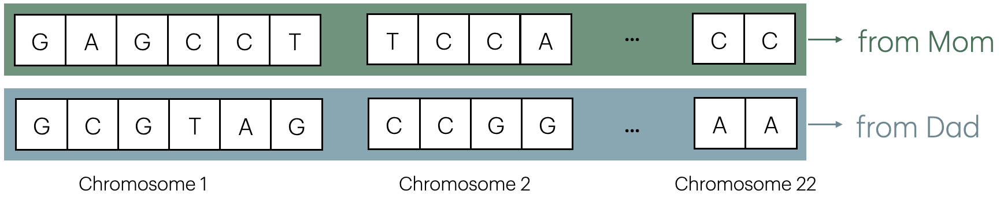
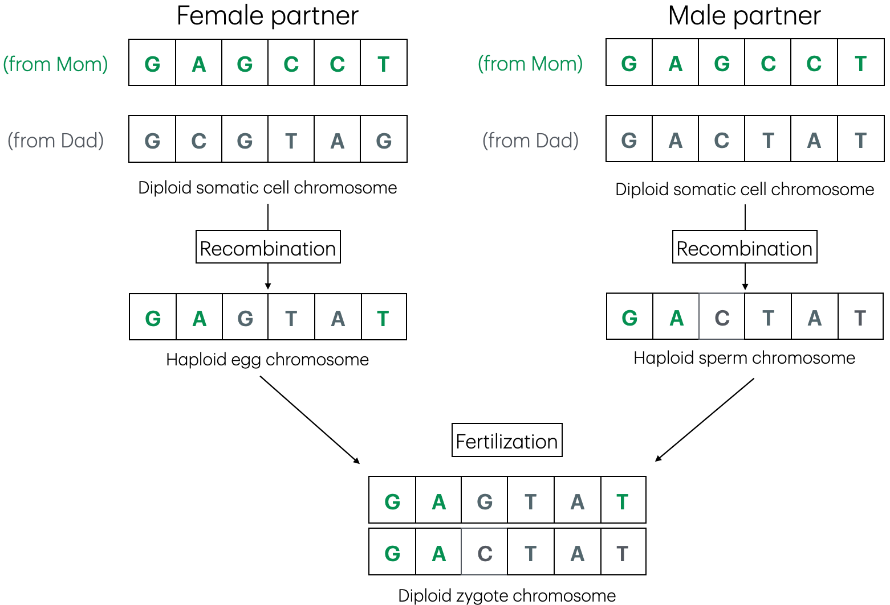
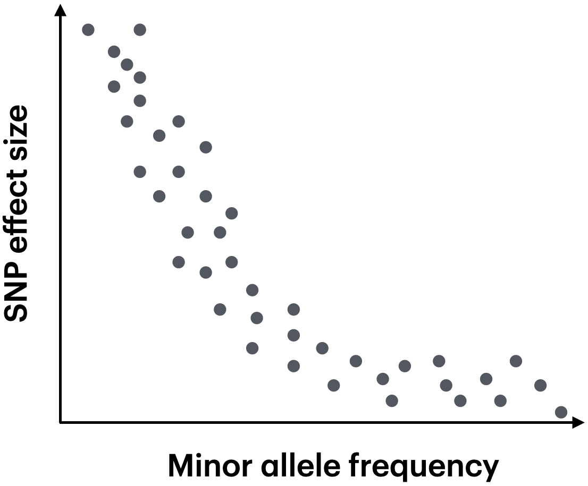
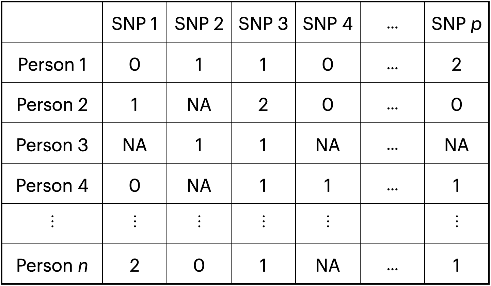

After years of observing from the outside, I finally am getting into the genetics space (more on that later). This post is an overview of the most fundamental of topics in genetics: genome-wide association studies (GWAS). First, I provide some background on molecular genetics. Then, I discuss the methodology underlying GWAS. Finally, I conclude with a discussion of the successes and limitations of GWAS.

## Molecular genetics background

The human genome consists of a set of 6 billion letters (or *nucleotides*). Each nucleotide can take one of four values: A, T, G, or C. An individual's set of nucleotides can be arranged into two non-overlapping "strings" of nucleotides. One of these nucleotide strings is inherited from one's mother, and the other is inherited from one's father. The strings are "homologous" in the sense that they are the same length (to first approximation) and can be thought of as a pair. The strings can be arranged linearly side-by-side. For example, in the example genome depicted in Figure 1, there is an "A" nucleotide (inherited from the mom) and a "G" nucleotide (inherited from the dad) at the second position from the left. We call a continuous region of the genome a *locus*. A locus can consist of a single nucleotide or a range of contiguous nucleotides.

The genome is partitioned into distinct physical pieces called chromosomes; there are 22 non-sex related chromosomes, or *autosomes*, and two sex-related chromosomes in the human genome. (We focus only on the autosomes in this blog post.) The genomic coordinate of a given locus is specified by the chromosome of the locus and the position along the chromosome at which the locus is located. For example, "chr1:150000" refers to the nucleotide on chromosome 1 located at position 150,000. Note that the notation "chr1:150000" does not refer specifically to either the maternal chromosome (i.e., the chromosome inherited from the mom) or the paternal chromosome (i.e., the chromosome inherited from the dad).

 

{#id .class width="100%" height="100%"}

At a given single-nucleotide locus, there may or may not be variation in the population. For example, all individuals in the population may have a "G" nucleotide on both their maternal and paternal chromosome at a given position. (That is to say, *all* chromosomes in a population may have the same nucleotide at one position.) On the other hand, at certain locations in the genome, there may be variation across the chromosomes of a population. For example, at a given single-nucleotide locus, half of chromosomes may have an "A" nucleotide and the other half of chromosomes may have a "C" nucleotide. Single-nucleotide loci for which there is variation across chromosomes are called *single-nucleotide polymorphisms* (or SNPs). The different nucleotides present at a given SNP are called *alleles*. We typically assume that a given SNP is *biallelic*, i.e., that it comes in two versions, for example "A" or "C." We label one of the alleles the *reference* allele and the other allele the *alternative* allele; this labeling is arbitrary. If an individual has two copies of the same allele (at a given location), we say that the individual is *homozygous* (at that location); by contrast, if an individual has one copy of the reference allele and one copy of the alternative allele, we say that the individual is *heterozygous* (at that location).

The goal of a *genome-wide association study (GWAS)* is to identify single-nucleotide loci that *cause* (or, less ambitiously, are *associated with*) a given trait or disease of interest. In carrying out a GWAS, we restrict our attention to SNPs, as only single-nucleotide loci that vary across individuals explain variation in a trait or disease. *Neutral theory* predicts that most SNPs in a given population are neutral with respect to a given trait, i.e. they do not affect (or explain variation) in the trait. Thus, a GWAS is a high-dimensional variable selection problem: we seek to identify a (relatively small) number of causal SNPs among a large set of neutral SNPs.

A *DNA (or SNP) microarray* is a device that enables the measurement of a predefined set of 500,000 --- 1,000,000 SNPs. One can use a DNA microarray to measure each of $\approx 500,000$ SNPs in a large number (e.g., $\approx 500,000$) of individuals. More recently, *whole exome sequencing* and *whole genome sequencing* have enabled the measurement of the *exome* (i.e., the set of coding regions of the genome) and the entire genome, respectively. Whole exome sequencing and whole genome sequencing data are collected using a *next-generation DNA sequencing machine* (instead of a DNA microarray). Our focus in this blog post is on DNA microarray data, as such data currently are more widespread than whole exome or whole genome sequencing data. (However, whole exome sequencing and whole genome sequencing data quickly are increasing in prevalence.)

## Sexual reproduction, recombination, and linkage disequilibrium

Sexual reproduction is an important topic in the context of GWAS, as the mechanics of sexual reproduction help explain the correlation structure of a set of SNPs. A *diploid cell* is a cell that contains 46 chromosomes (i.e., 22 pairs of autosomes and two sex chromosomes). Next, a *haploid cell* is a cell that contains only 23 chromosomes (i.e., a single set of 22 autosomes and a single sex chromosome). *Somatic* cells (i.e., body cells) are diploid cells, whereas *germ cells* (i.e., eggs and sperm) are haploid cells. To first approximation, sexual reproduction works as follows: within both the male partner and the female partner, a (diploid) somatic cell divides to form "daugther" (haploid) germ cells. Then, the male and female germ cells combine to form a diploid *zygote* in a process called *fertilization*. The zygote then multiplies via cell division, becoming an embryo and then a fetus, etc.

The process by which a diploid cell divides to form haploid daughter cells is called *meoisis*. Meoisis is a complicated cellular processes, but from our perspective, the most important event in meoisis is *recombination*. During recombination, corresponding segments of a pair of homologous chromosomes are exchanged to form a new "daughter chromosome." The daughter chromosome is a mix of the maternal and paternal chromosomes. Figure 2 illustrates recombination of a given chromosome (e.g., chromosome 1) during meoisis. Note that recombination occurs in both the male and female partners before fertilization. Meoisis helps increase the genetic diversity of an individual's (multiple) offspring, thereby conferring a selective advantage to the parent.

As a result of genetic recombination, SNPs that are in close physical proximity tend to be inherited together, while SNPs that are far away (or on different chromosomes) tend to be inherited (approximately) independently of one another. This phenomenon --- i.e., the phenomenon by which nearby SNPs are inherited together --- is called *linkage disequilibrium (LD)*. An *LD block* is a segment of the genome in which there is minimal genetic recombination. LD has important implications for the correlation structure of SNPs, as we will see.

 

{#id .class width="100%" height="100%"}

## Hardy-Weinberg equilibrium

Consider an individual and a SNP in the population. Let $I_1 \in \{0,1\}$ (resp., $I_2 \in \{0,1\}$) be a binary variable that takes value 1 if the maternal chromosome (resp., paternal chromosome) contains the alternative allele (and 0 otherwise). The number of alternative alleles $X$ that the individual possesses is equal to the sum of $I_1$ and $I_2$, i.e. $$X = I_1 + I_2.$$ If $I_1$ and $I_2$ are i.i.d. $\textrm{Bern}(p)$ random variables, then $X \sim \textrm{binom}(2,p)$. $I_1$ and $I_2$ are i.i.d. (and thus $X$ is binomially distributed) when (i) the population is infinitely large and (ii) mating among individuals in the population is random. If $X$ is binomially distributed, then we say that the corresponding SNP follows *Hardy-Weinberg equilibrium*. In practice, one can test if $X$ is binomially distributed by applying a binomial goodness of fit test. Most SNPs in the human genome turn out to be in approximate Hardy-Weinberg equilibrium. SNPs that fail to satisfy Hardy-Weinberg equilibrium generally are removed from GWAS, as departure from Hardy-Weinberg equilibrium typically results from technical errors in the genotyping step.

## SNP matrix, common and rare variants, correlation structure among SNPs

Suppose we use a SNP array to measure each of $p$ SNPs on a set of $n$ individuals. We obtain a *SNP matrix* $M \in \{0, 1, 2\}^{n \times p}$. Each entry of the SNP matrix takes a value in the set $\{0, 1, 2\}$; by convention, the $n$ individuals are stored in the rows and the $p$ SNPs are stored in the columns. A given entry $X_{i,j}$ of the matrix indicates the number of alternative alleles measured for individual $i$ at SNP $j$. (The specific reference and alternative alleles at SNP $j$ --- for example, "A" and "T" --- are not important.) A 0 indicates homozygosity of the reference allele; a 1 indicates heterozygosity; and a 2 indicates homozygosity of the alternative allele.

Consider a given biallelic SNP. The *major allele* (resp, *minor allele*) is the allele that occurs more (resp., less) frequently in the population. (Note that the major and minor alleles are conceptually distinct from the reference and alternative alleles; in other words, the major allele could be *either* the reference allele *or* the alternative allele, and the same goes for the minor allele.) The *minor allele frequency* is the frequency of the minor allele in the population. We can use the SNP matrix to estimate the MAF of a given SNP. Let $X_1, \dots, X_n$ denote the entries of the $j$th column of $M$ (i.e., the column of $M$ corresponding to SNP $j$). An estimate for the minor allele frequency is $$\widehat{\textrm{MAF}} = \min \left\{\frac{\sum_{i=1}^n X_i}{2n}, 1 -  \frac{\sum_{i=1}^n X_i}{2n} \right\}.$$ (Observe that $\sum_{i=1}^n X_i$ is the number of copies of the alternative allele across individuals, while $2n$ is the total number of alleles.)

 

{#id .class width="80%"}

A *rare variant* is a SNP whose minor allele frequency is small, where "small" operationally is defined as $1\%$. By contrast, a *common variant* is a SNP that is not a rare variant. Typically, we filter out rare variants in a GWAS, as the "effective sample size" of rare variants is insufficiently large to enable well-powered inference. However, as GWAS sample sizes increase, rare variant analysis is becoming increasingly practical. Rare variants typically exert a larger effect on the phenotype than common variants (Figure 4). In other words, as the MAF of a SNP increases, its effect size on the phenotype generally decreases. This phenomenon occurs because natural selection tends to remove alleles with large, deleterious effects from the gene pool. Rare variants are especially interesting in the context of drug discovery, as their alteration potentially could lead to especially large changes to the phenotype. A special type of rare variant is a *de novo variant*. A de novo variant is a variant that appears for the first time in the germ cell of a parent (and is not present in the somatic cells of the parent). De novo variants result from mutations in a sperm or egg cell.

 

{#id .class width="60%"}

Due to linkage disequilibrium, SNPs that are in close physical proximity tend to be highly correlated with one another (across individuals in a population). Let $\Sigma = (1/n) X X^T$ denote the empirical correlation matrix of the SNPs. Let $\Sigma_{i,j}$ denote the correlation between SNPs $i$ and $j$. A very rough model for $\Sigma$ is as follows. If SNPs $i$ and $j$ are in the same LD block, then $\Sigma_{i,j}$ is big (e.g., $\Sigma_{i,j} \approx 0.99$); on the other hand, if SNPs $i$ and $j$ are in different LD blocks, then $\Sigma_{i,j}$ is fairly small (e.g., $\Sigma_{i,j} \approx 0.15$). (SNPs in different LD blocks tend to be weakly but positively correlated due to population stratification, which we will discuss shortly.)

## GWAS

Genome wide association studies (GWAS) aim to identify SNPs associated with a given disease or trait. A GWAS proceeds as follows. First, we select a trait of interest. The trait can be binary (e.g., presence or absence of bipolar disorder) or continuous (e.g., blood lipid level). For simplicity we will assume that the trait is a binary disease status (although the analysis proceeds similarly if the trait is continuous). Next, we collect data on $n_1$ subjects *with* the disease and $n_2$ healthy controls. For each of the $n := n_1 + n_2$ subjects, we measure $p \approx 500,000$ SNPs, resulting in a SNP matrix $X \in \{0,1,2\}^{n \times p}$. Additionally, we collect demographic factors $Z_1, \dots, Z_n \in \mathbb{R}^d$ on each subject, such as age and sex. We assume that all subjects come from the same "ancestry group." (As far as I can tell, there are three main "ancestry groups" used in modern genetics research: African, Asian, and European.) Finally, let $Y = [Y_1, \dots, Y_n]^T \in \{0,1\}^n$ denote the binary vector indicating whether a given individual has the disease.

There are five main steps involved in carrying out a GWAS: performing quality control on the SNP matrix, imputing missing SNPs, performing PCA on the SNP matrix, carrying out the regressions, and then applying a multiple testing correction. We describe each of these steps one-by-one.

### Quality control (QC)

In practice the SNP matrix typically does not look quite like the SNP matrix depicted in Figure 3. Rather, some of the entries are missing due to technical errors in the genotyping process. A more realistic SNP matrix is shown in Figure 5. A subset of the entries is missing, as denoted by "NA." The quality control step involves removing low-quality SNPs (columns) and subjects (rows) from the analysis. (Not all quality control steps relate to missingness.)

 

{#id .class width="80%"}

-   **SNPs and subjects with many missing values**. Some SNPs and subjects may have a large proportion of missing values. A common practice is to exclude SNPs and subjects whose missingness exceeds 10%.
-   **Heterozygosity check**. If a given subject is heterozygous on most alleles (i.e., the subject has a very large fraction of 1's and a comparatively small fraction of 0's and 2's), there likely were technical problems in genotyping that subject. Subjects with very high heterozygosity typically are removed from the analysis.
-   **Minor allele frequency filtering**. Recall that we can estimate the minor allele frequency of a given SNP via $\widehat{MAF}$. SNPs with a very low minor allele frequency have a small "effective sample size" and thus are challenging to perform statistical inference on. We typically remove SNPs whose minor allele frequency is below 10%.
-   **Hardy-Weinberg equilibrium filtering**. Recall that most SNPs in the population follow Hardy-Weinberg equilibrium, i.e. the number of alternative alleles that a given subject possesses is approximately binomially distributed. SNPs that deviate from Hardy-Weinberg equilibrium likely were measured incorrectly and thus are removed. We can check for Hardy-Weinberg equilibrium by running a binomial goodness of fit test on the data for each SNP.
-   **Additional QC checks**. Additional QC checks sometimes are performed, such as checking for relatedness of subjects to ensure (approximate) independence across samples.

### SNP imputation

Even after performing QC, some entries of the SNP matrix will be missing. In preparation for the next step (i.e., PCA on the SNP matrix), it is standard to impute the missing entries of the SNP matrix. Both simple and sophisticated imputation techniques have been developed for this purpose. One common technique is to assign the most common value (i.e., 0, 1, or 2) of a given SNP to the missing entries of that SNP. This strategy, although simple, seems to work quite well in practice.

### PCA on the SNP matrix

*Population stratification* refers to the presence of multiple distinct "subpopulations" in a collection of subjects. Population stratification can exert a confounding effect, leading to spurious associations and a loss of type-I error control. For example, suppose that a given sample consists of two subpopulations, namely "subpopulation A" and "subpopulation B." Consider a given SNP. Suppose that the alternative allele is more prevalent in subpopulation A than B. Moreover, suppose that members of subpopulation A are more likely than members of subpopulation B to have the disease. Suppose further that the increased prevalence of the disease in subpopulation A is *not* due to the given SNP. (For example, members of subpopulation A may live in a different environment than members of subpopulation B, and the disease may have an environmental component.) If we naively tested for association between the given SNP and presence or absence of the disease, we would incorrectly conclude that the SNP is associated with the disease. It is therefore necessary to control for subpopulation to neutralize this confounding effect.

The standard approach to adjust for population stratification is to perform PCA on the SNP matrix. The PCA yields $k$ PCs $v_1, \dots, v_n \in \mathbb{R}^n$ (where $k$ is chosen heuristically or set to some prespecified number, e.g. $\approx 15$). The PCs capture population heterogeneity and can be included in the regression model to control for population stratification.

### Regression

The next (and in my opinion most interesting) step of the GWAS analysis pipeline is to test for association between each SNP and the phenotype by fitting a large number of logistic regression models. Consider a given SNP. For a given subject $i$, let $y_i \in \{0,1\}$ denote the phenotype; let $x_i \in \{0,1,2\}$ denote the number of alternative alleles; let $z_i \in \mathbb{R}^d$ denote the vector of demographic factors (e.g., age, sex, etc.); and let $w_i \in \mathbb{R}^k$ denote the top $k$ PCs. We hypothesize the following logistic regression model for the data: $$y_i \sim \textrm{Bern}(\mu_i); \quad \textrm{logit}(\mu_i) = \beta_0 + \beta x_i + \delta^T w_i + \gamma^T z_i,$$ where $\beta_0 \in \mathbb{R}, \beta \in \mathbb{R}, \delta \in \mathbb{R}^k$ and $\gamma \in \mathbb{R}^d$ are unknown regression coefficients.

We fit the model via MLE, yielding an estimate $\hat{\beta}$ for $\beta$ and a p-value $p$ for a test of the null hypothesis $H_0: \beta = 0$. (This p-value typically is obtained via Wald or likelihood ratio test.) If the trait is continuous, then we fit a linear regression model rather than a logistic regression model to the data.

### Multiple testing correction

The regression analysis yields a set of $p$ p-values $p_1, \dots, p_p$. We obtain a discovery set via a very simple procedure: we call all SNPs whose p-value falls below the threshold of $5 \cdot 10^{-8}$ as discoveries. Some more recent GWAS analyses apply a BH correction to the p-values to produce a discovery set, but this does not appear to be the norm.

### Software

The most common statistical software package for carrying out a GWAS is [PLINK](https://www.cog-genomics.org/plink/). PLINK implements all the methods described above in highly efficient C code.

### Summary statistics

Unfortunately, due to privacy concerns, it is quite challenging and cumbersome to obtain access to GWAS data. (In particular, the SNP matrix contains highly sensitive genetic information.) GWAS studies typically publish *summary statistics* in place of the raw data. The summary statistics include the p-value, estimated regression coefficient $\hat{\beta}$, and estimated standard error of the regression coefficient $\sqrt{\widehat{V(\hat{\beta})}}$ for each SNP. Researchers can use the summary statistics to conduct secondary analyses of GWAS data.

## Takeaways and limitations of GWAS

GWAS have identified hundreds of thousands of SNPs associated with hundreds of traits and diseases, yielding several interesting (and perhaps surprising) insights about the architecture of complex traits. For example, most traits are highly polygenic, i.e., they are influenced by tens of thousands (or more) of SNPs spread aross the genome. Additionally, the vast majority ($>95\%$) of significant SNPs lie in noncoding regions of the genome. These noncoding SNPs are thought to contribute to disease by modulating the expression of one more or disease-relevant genes.

Despite their success, GWAS present several limitations, two of which we highlight here. First, due to LD (i.e., multicolinearity among the SNPs), it is challenging to identify a causal SNP among a set of SNPs in close physical proximity to one another. Second, it is unclear *how* SNPs in noncoding regions in the genome impact the phenotype. In particular, the gene (or genes) through which most noncoding SNP exert their effect is unknown. These limitations have impeded the translation of GWAS results into therapeutics for genetic diseases. In future blog posts I will explore genomic technologies (e.g., eQTLs studies, CRISPR experiments) and analytic tools that have been developed to overcome the limitations of GWAS.

## References

This post is based on a couple excellent references on GWAS.

-   The [GWAS lecture notes](https://www.mv.helsinki.fi/home/mjxpirin/GWAS_course/) by Prof Matti Pirinen.

-   The [GWAS tutorial](https://pbreheny.github.io/adv-gwas-tutorial/) by Prof Patrick Breheny.
