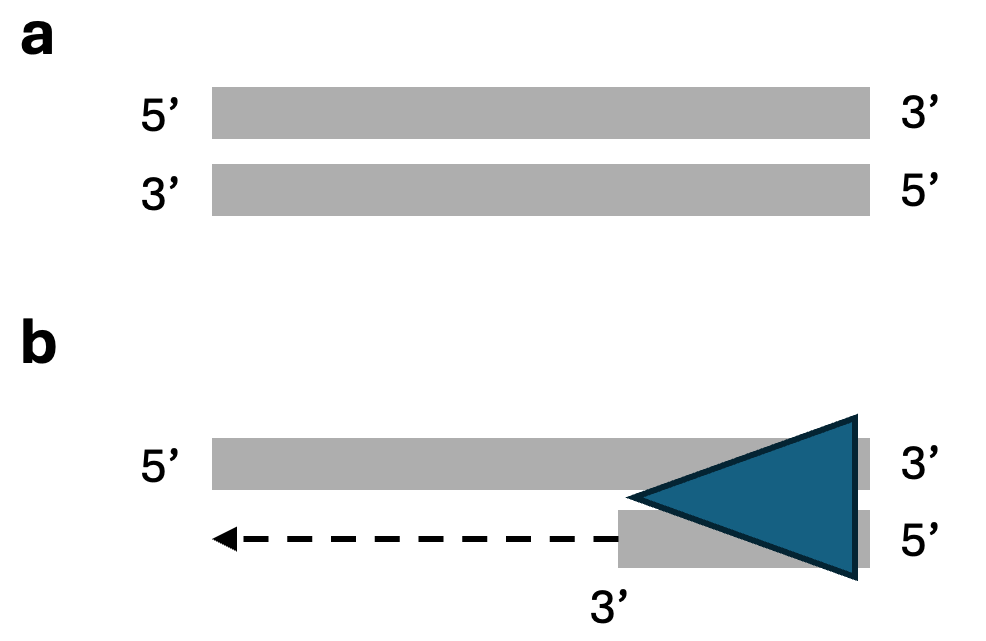

Next generation sequencing enables scientists to accurately and cost-efficiently determine the base-pair sequence of a fragment of DNA. Next generation sequencing forms the basis of much of contemporary genomics, from identifying genetic variants to quantifying gene expression to profiling the editing activity of CRISPR systems. This blog post is meant to provide a fairly in-depth exposition of Illumina next-generation sequencing. It is a followup to my earlier blog post on next-generation sequencing from 2020. (The earlier blog post is not a prerequisite of this one.)

Next-generation sequencing comprises several steps: DNA shearing and adapter ligation, polymerase chain reaction, and base calling. Multiplexing and molecular barcoding allow for sequencing multiple experiments in parallel and nuetralizing biases arising from polymerase chain reaction, respectively. We discuss these topics in some detail below.

# DNA review

DNA is a double-stranded molecule composed of four types of nucleotide bases: A (adenine), T (thymine), G (guanine), and C (cytosine). Each DNA strand has a specific directionality, with one end designated as the 5' (five-prime) end and the other as the 3' (three-prime) end. In a double-stranded DNA molecule, the two strands run in opposite directions: one strand runs from 5' to 3' (top, Figure 1a), while the other runs from 3' to 5' (bottom, Figure 1a).

 

{width=50%}

Polymerase is an enzyme that synthesizes a new DNA strand complementary to a template strand. To begin synthesis, a short segment of DNA complementary to the template strand --- *the primer* --- must be bound to the template strand. Polymerase then "extends" this primer, synthesizing the full complementary strand in the 5' to 3' direction. Importantly, polymerse only can add bases in the 5' to 3' direction. The biology of polymerase underlies DNA replication, DNA transcription, and next generation sequencing.

# DNA shearing and tagmentation

