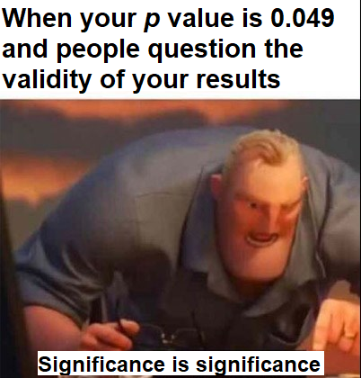

Hello world,

Welcome to my blog. This is my first blog post ever (hi Mom). I intend to use this blog to cover topics in statistics, genetics, and genomics. Lots of people use these terms in different ways, so maybe I should start by defining these terms myself.

**Statistics**: The science and practice of drawing insights from datasets. Statistics has two main objectives: understanding relationships between variables and making predictions.

**Genetics**: The study of how traits are passed from parent to offspring and from generation to generation.

**Genomics**: The biochemical study of gene expression and regulation.

 

{#id .class width=50% height=50%}

*Figure 1. This figure does not convey any useful information. Left: the Greek letter sigma for statistics; right: a strand of DNA for genetics and genomics.*

 
How do statistics, genetics, and genomics fit together? Biological technologies developed over the past decade have given rise to very large, whole-genome genetic and genomic datasets. To pull something useful out of these data, researchers need to leverage up-to-date statistical and machine learning tools. Conversely, modern biological datasets have inspired the development of new statistical theory, especially in the areas of high-dimensional inference and prediction. In this blog I will explore current ideas at the intersection of genetics, genomics, and statistics, such as CRISPR-Cas9 genome editing, single-cell RNA-seq, and lentiviral gene delivery. Topics for the most part will be drawn from my own research, but I hope other scientists working in this space will find the posts helpful. My goal is to post about once a month.

And yes, there may be memes.

{#id .class width=50% height=50%}

*Figure 2. Courtesy of Statistical Statistics Memes.*

