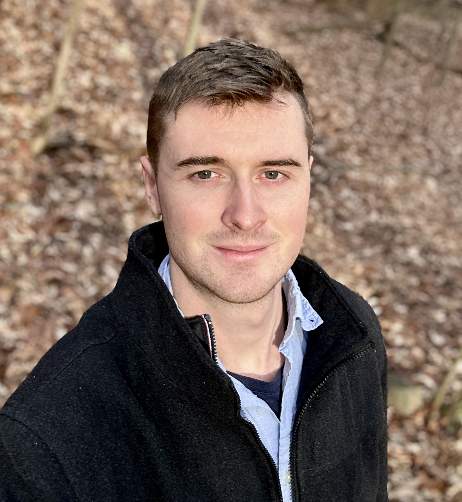

```{r setup, include=FALSE}
htmltools::tagList(rmarkdown::html_dependency_font_awesome())
```

```{css, echo=FALSE}
d-title {
    display: none;
  }
```

::: {.floatting}
```{r out.width='25%', out.extra='style="float:right; padding:10px"', echo=FALSE, fig.align='right'}

```

I am a postdoctoral researcher at Boston Children's Hospital and Massachusetts General Hospital, advised by Dan Bauer, Luca Pinello, and Danilo Pellin. I obtained my PhD in Statistics at Carnegie Mellon University. I work in statistical genomics, with a focus on statistical problems arising in CRISPR screen analysis and CRISPR therapeutic development. 

Methodologically, I am interested in independence and conditional independence testing, multiple testing, efficient algorithms for genomics, and (more recently) deep learning.

timothy.barry@childrens.harvard.edu, [CV](ResumeCv/cv.pdf)
