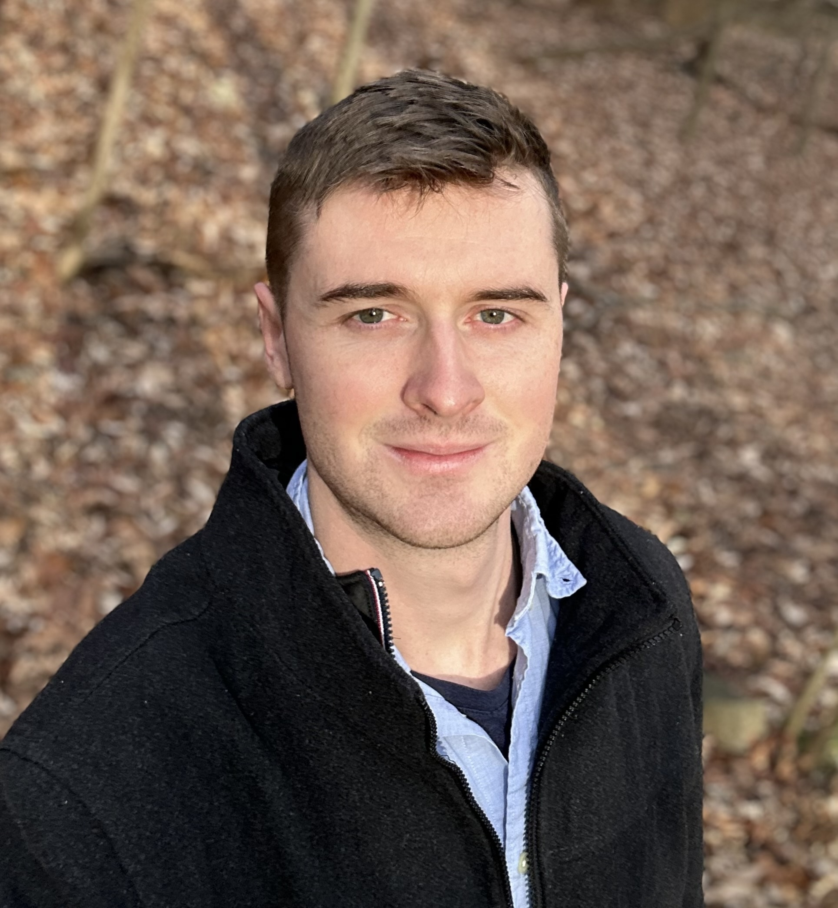

```{r setup, include=FALSE}
htmltools::tagList(rmarkdown::html_dependency_font_awesome())
```

```{css, echo=FALSE}
d-title {
    display: none;
  }
```

::: {.floatting}
```{r out.width='25%', out.extra='style="float:right; padding:10px"', echo=FALSE, fig.align='right'}

```

I am a postdoctoral researcher in the Department of Biostatistics at Harvard University, advised by [Xihong Lin](https://content.sph.harvard.edu/xlin/index.html). Previously, I obtained my PhD in Statistics at Carnegie Mellon University under the joint supervision of [Kathryn Roeder](http://www.stat.cmu.edu/~roeder/) and [Eugene Katsevich](https://ekatsevi.github.io). My research focuses on coupling simple, principled, and fast statistical methods to emerging technologies in genomics and computer science, such as CRISPR genome editing, single-cell sequencing, and big data processing systems. Much of this work is motivated by the goal of understanding the role noncoding genetic variation in human disease. I am especially interested in the following areas.
:::

-   **Statistics**: independence and conditional independence testing, robust methods, measurement error.

-   **Genomics**: CRISPR experiments, in particular single-cell CRISPR screens.

-   **Computing**: data structures and algorithms for scalable single-cell analysis, clouds and clusters, large language models. (I am currently a novice in the latter technology!)

Feel free to shoot me an email at tbarry@hsph.harvard.edu. Also, here is my [CV](ResumeCv/cv.pdf).