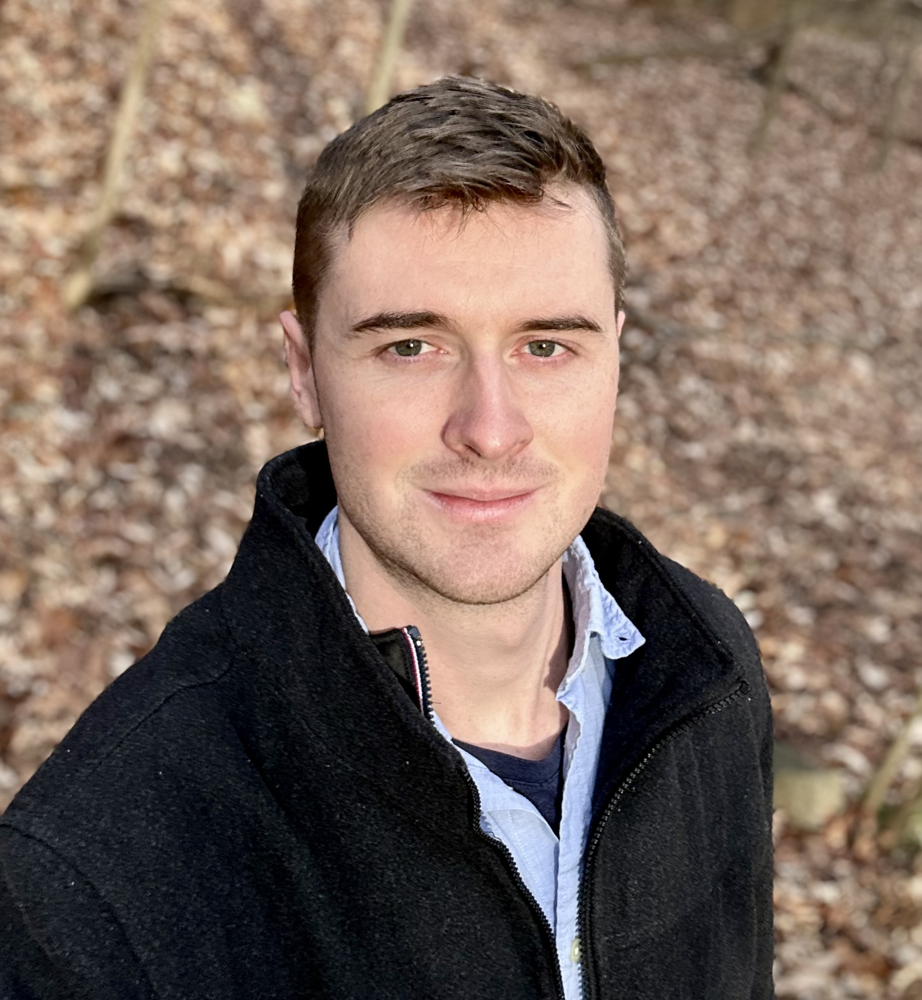

```{r setup, include=FALSE}
htmltools::tagList(rmarkdown::html_dependency_font_awesome())
```

```{css, echo=FALSE}
d-title {
    display: none;
  }
```

<div class="about-float">


<p>I am a postdoctoral researcher at Boston Children's Hospital and Massachusetts General Hospital, advised by Dan Bauer, Luca Pinello, and Danilo Pellin. I obtained my PhD in Statistics at Carnegie Mellon University. I work in statistical genomics, with a focus on problems arising in CRISPR genome engineering applications.</p>

 I am on the faculty job market in fall 2026. <p><a href="mailto:timothy.barry@childrens.harvard.edu">timothy.barry@childrens.harvard.edu</a>, <a href="ResumeCv/cv.pdf">CV</a>, <a href="https://scholar.google.com/citations?user=Jrjax-AAAAAJ&hl=en">Scholar</a></p>
</div>
