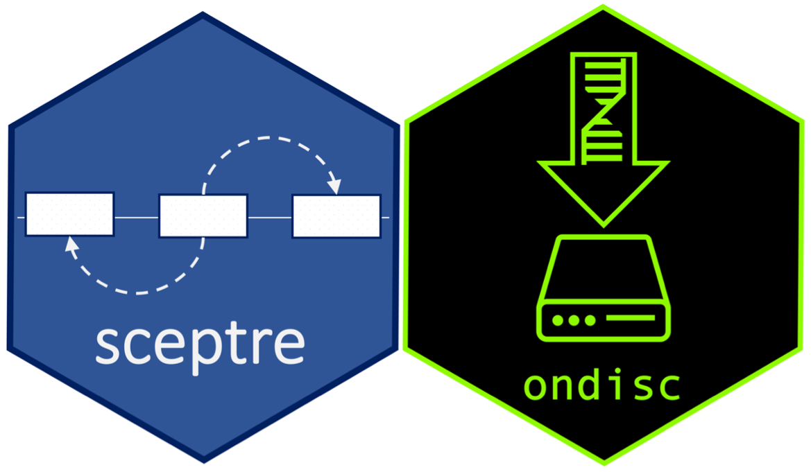

# Recent paper(s)

See [CV](ResumeCv/timsResume.pdf) for full list.

1. E Katsevich, **T Barry**, K Roeder. "Conditional resampling improves calibration and sensitivity in single-cell CRISPR screen analysis." Preprint on [bioRxiv](https://www.biorxiv.org/content/10.1101/2020.08.13.250092v3).

# Software

```{r pressure, echo=FALSE, out.width = '60%', fig.align="center"}

```

1. [**sceptre**](https://github.com/timothy-barry/SCEPTRE): A statistical tool for robustly inferring regulatory relationships in single-cell CRISPR screen assays.

2. [**ondisc**](https://timothy-barry.github.io/ondisc/): A computational engine for powering large-scale analyses of single-cell data; designed to run on all platforms, from laptops to supercomputers.